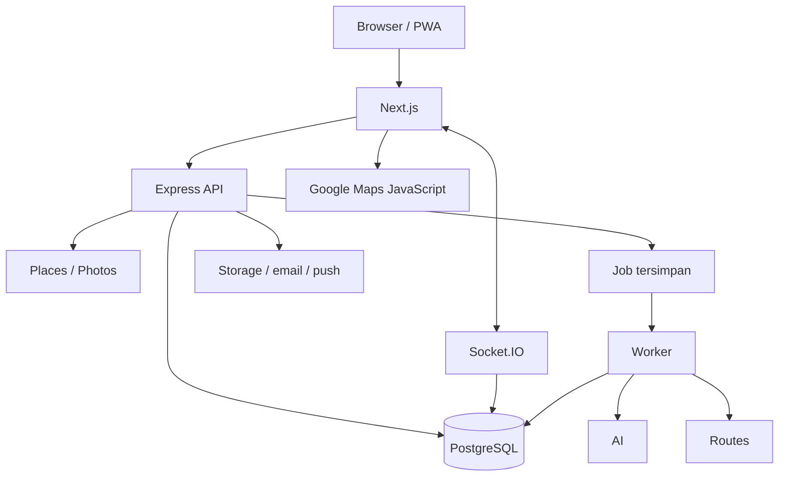

# PRD Dolan

**Versi:** 1.1 — baseline untuk review tim; diperjelas konsep join gratis  
**Tanggal:** 11 September 2026  
**Produk:** Social travel website, mobile-first PWA  
**Pembaca:** Seluruh tim produk, desain, frontend, backend, dan penguji

Dokumen ini menjadi acuan bersama tentang apa yang harus dibangun, bagaimana perilakunya, dan kapan fitur dianggap selesai. Bagian teknis memberikan arah implementasi; kontrak endpoint, migrasi SQL, dan detail deployment akan diturunkan dari dokumen ini.

## Daftar isi

1. Ringkasan dan tujuan
2. Cakupan dan keputusan
3. Pengguna dan hak akses
4. Struktur halaman dan user flow
5. Kebutuhan fitur dan kriteria penerimaan
6. UI/UX dan PWA
7. Stack dan alur teknis
8. Model data dan relasi
9. Keamanan, privasi, dan pengendalian biaya
10. Pengujian dan ukuran keberhasilan
11. Tahapan kerja dan deployment
12. Asumsi, validasi terbuka, dan referensi

## 1. Ringkasan dan tujuan

Dolan membantu pengguna menemukan tempat wisata nyata, membuat rencana perjalanan sesuai waktu dan budget, serta mencari teman perjalanan. Pengguna dapat membuat trip sendiri, menyalin itinerary, atau mengajukan ikut trip publik milik orang lain.

**Prinsip utama: join trip gratis.** Dolan mempertemukan pengguna yang ingin bepergian ke tujuan yang sama agar dapat berjalan bersama. Setiap peserta menanggung biaya liburannya sendiri. Host adalah pembuat rencana dan koordinator sesama traveler, bukan penjual paket wisata atau penerima pembayaran peserta. Persetujuan join tidak menimbulkan kewajiban membayar host.

Masalah yang ingin diselesaikan:

- Pengguna belum tahu tujuan yang sesuai budget dan waktu liburan.
- Penyusunan jadwal serta urutan kunjungan memerlukan banyak pencarian terpisah.
- Pengguna ingin menemukan teman perjalanan dan mengenalnya sebelum berangkat.
- Diskusi, itinerary, dan informasi peserta sering tersebar di beberapa aplikasi.
- Pengguna membutuhkan riwayat dan ulasan rekan perjalanan untuk mempertimbangkan calon teman trip.

Keberhasilan final project berarti alur utama bekerja end-to-end dengan data wisata nyata, antarmuka mobile yang nyaman, dan aturan akses yang benar. Kelengkapan seluruh destinasi Indonesia, harga booking aktual, atau layanan tanpa batas bukan janji produk.

## 2. Cakupan dan keputusan

### 2.1 Keputusan yang disepakati

| Bagian | Keputusan |
| --- | --- |
| Platform | Website responsif, mobile-first, mendukung PWA |
| Jangkauan | Pencarian destinasi Indonesia; kelengkapan mengikuti sumber |
| Data wisata | Google Places API (New); tidak memakai lokasi dummy sebagai data produk |
| Foto dan rating wisata | Google jika tersedia, dengan atribusi sesuai ketentuan |
| Peta dan perjalanan | Google Maps JavaScript API, Routes API, dan Maps URLs |
| Realtime | Socket.IO |
| Model trip | Pertemanan perjalanan; join gratis dan biaya liburan ditanggung masing-masing |
| AI | Rekomendasi destinasi, penyusunan itinerary, checklist, dan bantuan estimasi |
| Rating sosial | Diberikan antaruser yang benar-benar mengikuti trip yang sama |
| Hubungan sosial | Follow satu arah; saling follow ditandai sebagai saling mengikuti |
| Anggaran | Kurang dari Rp1 juta untuk layanan/API; hosting dan deployment di luar anggaran ini |
| Prioritas pengalaman | Data nyata, fitur kolaborasi, UI interaktif, dan performa mobile |

### 2.2 Target fitur rilis

Homepage, Explore, detail wisata, detail trip publik, auth/profil, buat trip, rekomendasi AI, editor itinerary, budgeting, template itinerary, My Trip, join/approval, komentar publik, chat, notifikasi, berbagi lokasi, PDF, link itinerary/navigasi, follow, feedback antaruser, serta moderasi dasar.

Seluruh fitur tersebut adalah target produk. Jika deadline tidak mencukupi, perubahan cakupan harus diputuskan tim secara eksplisit; fitur tidak diam-diam diganti dengan simulasi.

### 2.3 Tidak termasuk rilis awal

- Booking atau pembayaran hotel, pesawat, tiket wisata, dan pengumpulan uang peserta.
- Penjualan paket trip, biaya join, uang muka kepada host, komisi host, checkout, dan status pembayaran peserta.
- Verifikasi KTP, biometrik, atau klaim identitas resmi.
- Aplikasi native dan pelacakan lokasi terus-menerus saat aplikasi ditutup.
- Direct message antaruser di luar grup trip.
- Badge kepercayaan, cancel rate, atau klaim keamanan tanpa aturan dan data pendukung.
- Jaminan harga aktual, itinerary paling optimal secara matematis, atau operasional gratis selamanya.

## 3. Pengguna dan hak akses

Host dan peserta adalah peran pada suatu trip, bukan jenis akun permanen. Seseorang dapat menjadi host di satu trip dan peserta di trip lain.

| Tindakan | Pengunjung | User login | Host trip | Peserta diterima |
| --- | --- | --- | --- | --- |
| Melihat wisata dan trip publik | Ya | Ya | Ya | Ya |
| Membaca komentar publik dan profil publik | Ya | Ya | Ya | Ya |
| Membuat/menyalin trip dan follow | Login dahulu | Ya | Ya | Ya |
| Menulis komentar trip publik | Login dahulu | Ya | Ya | Ya |
| Mengajukan join | Login dahulu | Ya, jika memenuhi syarat | Tidak ke trip sendiri | Tidak menggandakan keanggotaan |
| Mengubah itinerary bersama | Tidak | Tidak | Ya | Tidak |
| Approve/reject pengajuan | Tidak | Tidak | Ya | Tidak |
| Membaca chat trip | Tidak | Tidak, termasuk pending | Ya | Ya |
| Melihat lokasi presisi anggota | Tidak | Tidak | Sesuai izin berbagi | Sesuai izin berbagi |
| Memberi feedback | Tidak | Hanya jika memenuhi syarat trip | Sesuai keikutsertaan | Sesuai keikutsertaan |

Admin mengelola laporan, status konten/akun, dan template kurasi. Admin tidak otomatis memperoleh akses UI ke percakapan atau lokasi pribadi; penanganan laporan dibatasi pada bukti yang diperlukan dan dicatat.

## 4. Struktur halaman dan user flow

### 4.1 Navigasi

- Menu utama: Home, Explore, My Trip, Profil.
- Aksi Buat Trip mudah diakses dari navigasi/header dan detail wisata.
- Notifikasi diakses melalui ikon dengan indikator belum dibaca.
- Chat diakses melalui trip terkait dan notifikasi.
- Profil pemilik menyediakan pengaturan akun, privasi, dan izin perangkat.

### 4.2 Alur utama

**Menemukan wisata:** Home/Explore → cari tujuan → detail wisata → buat trip atau pakai itinerary.

**Mencari teman perjalanan:** Explore/detail wisata → detail trip publik → baca profil host/peserta → komentar/perkenalan → ajukan join → tunggu keputusan → chat jika diterima.

**Tujuan sudah diketahui:** Isi asal, tujuan, tanggal, moda, peserta, budget → generate itinerary → periksa/edit → simpan private atau publikasi.

**Tujuan belum diketahui:** Aktifkan Bantu AI → isi kebutuhan → lihat kandidat dan estimasi → pilih/regenerate/cari lebih hemat → generate itinerary → edit → simpan/publikasi.

**Memakai template:** Pilih template → login jika perlu → salin ke draft pribadi → isi asal dan kebutuhan → hitung ulang → edit → simpan.

**Setelah perjalanan:** Trip selesai → konfirmasi keikutsertaan → beri feedback antaruser → rating dan riwayat tampil sesuai privasi profil.

Login yang dipicu tindakan harus kembali ke tindakan tersebut. Pilihan destinasi dan input yang aman dipertahankan; aksi publik seperti komentar atau publikasi tetap memerlukan tindakan kirim dari pengguna setelah login.

## 5. Kebutuhan fitur dan kriteria penerimaan

### F01 — Homepage

Hero memakai langit cerah, globe setengah di kiri dan slogan/pencarian di kanan pada desktop. Pada mobile, hierarki menyesuaikan layar. Input pencarian memuat tujuan dan tanggal liburan.

Saat pencarian berlangsung, globe berputar sebagai indikator. Hasil muncul dalam modal card dan membawa pengguna ke detail. Halaman juga memuat destinasi populer, penjelasan manfaat, dan ajakan membuat trip.

**Diterima ketika:** hasil berasal dari Google; animasi berhenti pada sukses/gagal; hasil kosong dan error jelas; pencarian baru tidak tertimpa respons lama; animasi tidak menunda hasil yang sudah siap.

### F02 — Explore dan peta

Tab Wisata mencari tempat dari Google; tab Trip mencari rencana publik dari database Dolan. Input mendukung kota dan nama destinasi. Lokasi filter berasal dari izin perangkat atau input manual.

- Wisata: relevansi, populer, dan terdekat.
- Trip: populer, titik mulai publik terdekat, dan tanggal berangkat terdekat.
- Tanggal wisata adalah konteks perencanaan, bukan ketersediaan booking.
- Pengguna pending atau host yang terlihat di card bukan berarti lokasi langsungnya dibagikan.

Default awal popularitas Dolan: jumlah trip publik aktif yang mengunjungi destinasi; popularitas trip: jumlah peserta aktif non-host, lalu pengajuan pending. Label menjelaskan bahwa ini aktivitas Dolan. Jika data belum cukup, gunakan pilihan kurasi berlabel; jangan mengarang aktivitas. Definisi ini adalah default produk yang dapat direview tim.

Desktop: daftar kiri dan peta kanan. Mobile: peta sebagai lapisan utama dengan bottom sheet daftar. Perubahan viewport tidak otomatis memanggil pencarian tanpa batas; sediakan Cari di area ini.

**Diterima ketika:** tab memiliki sumber dan filter yang benar; marker/card sinkron; ada paginasi; penolakan izin lokasi tidak memblokir pencarian; data private tidak muncul; lokasi yang tidak punya nama/identitas memadai tidak masuk rekomendasi utama.

### F03 — Detail wisata

Menampilkan informasi Google yang tersedia, foto dan atribusi, rating wisata beserta jumlah penilaian, alamat, peta, jadwal, serta tautan sumber. Menampilkan trip publik dan template yang mengunjungi tempat tersebut.

Tindakan berbeda: Buat trip ke sini, Pakai itinerary, dan Gabung trip. Informasi tidak tersedia diberi keadaan kosong yang jujur. Tidak ada harga nol, rating palsu, atau foto tempat lain sebagai pengganti.

**Diterima ketika:** tujuan otomatis terisi ketika membuat trip; sumber rating wisata terpisah dari rating pengguna; detail tetap berguna jika foto/jadwal tidak tersedia; satu trip tidak muncul berulang pada daftar yang sama.

### F04 — Akun dan profil

Registrasi, login, logout, verifikasi email, reset password, dan pengelolaan sesi. Profil mencakup username unik, nama, avatar, cover, domisili, dan bio. Email serta data login bukan informasi profil publik.

Default: membaca fitur publik bebas login; membuat draft memerlukan login; publikasi trip, join, komentar, dan follow memerlukan email terverifikasi. Sebelum publikasi/join, nama tampilan, username, dan domisili harus terisi. Kelengkapan bukan verifikasi identitas.

**Diterima ketika:** username/email duplikat ditangani; password/token tidak dikembalikan API; pengguna kembali ke konteks sebelum login; pemilik melihat Edit Profil dan pengguna lain melihat Follow; cover/avatar dapat diganti dengan validasi unggahan.

### F05 — Form buat trip

Input: judul, deskripsi, asal, tujuan atau Bantu AI, tanggal mulai/selesai, transportasi, budget, basis per orang/rombongan, jumlah orang untuk perencanaan, preferensi aktivitas/penginapan, serta private/public. Public menambahkan kapasitas dan titik pertemuan yang boleh ditampilkan.

Kapasitas termasuk host. Jumlah peserta perencanaan tidak otomatis sama dengan kapasitas maksimum. Asal pribadi tidak otomatis menjadi titik pertemuan publik.

Untuk trip publik, tampilkan estimasi pengeluaran per orang dengan label jelas. Basis total rombongan tetap boleh digunakan sebagai alat perencanaan, bukan tarif paket atau tagihan kepada peserta. Form tidak menyediakan harga join, rekening pembayaran host, atau kewajiban deposit.

**Diterima ketika:** tanggal/budget/jumlah orang tervalidasi; tujuan kosong hanya di jalur rekomendasi AI; form tersimpan sebagai draft; pilihan public tidak memublikasikan hasil yang belum dikonfirmasi; klik ganda tidak membuat trip duplikat.

### F06 — Rekomendasi destinasi dan budgeting AI

AI menerima kebutuhan pengguna dan kandidat tempat nyata. Pengguna dapat memilih kandidat, meminta alternatif lain, atau alternatif lebih hemat. Sistem tidak menjanjikan semua budget dapat dipenuhi.

Budget memuat transportasi pulang-pergi, transportasi lokal, penginapan, makan, aktivitas/tiket, biaya lain, dan cadangan. Tampilkan rentang, satuan, jumlah, asumsi, sumber, dan tanggal referensi bila ada. User dapat mengganti asumsi dengan harga yang diketahui.

Budget adalah alat bantu merencanakan pengeluaran masing-masing, bukan harga untuk bergabung. Estimasi host menjadi referensi, bukan tagihan seragam: peserta dapat memiliki asal, transportasi, atau penginapan berbeda. Jangan otomatis membagi semua pengeluaran dengan kapasitas trip atau mengasumsikan peserta membayar biaya host. Jika pengguna secara eksplisit merencanakan berbagi kamar/kendaraan, perhitungan hanya menunjukkan estimasi porsi biaya; Dolan tidak menagih atau mengelola pelunasannya.

Backend menghitung jumlah dan subtotal; AI tidak menjadi kalkulator final. Harga hotel/pesawat/kereta tanpa integrasi harga aktual diberi label perkiraan, bukan penawaran yang tersedia. Harga yang belum diketahui tidak dianggap gratis.

**Diterima ketika:** tempat tidak dikarang; total per orang/rombongan benar; budget kurang menghasilkan alternatif yang mengubah rencana/asumsi secara masuk akal; hasil tak valid tidak disimpan sebagai final; kuota AI habis tidak menghapus draft atau menghalangi edit manual.

### F07 — Itinerary, routing, dan editor

Itinerary memuat checklist persiapan, hari/tanggal, waktu perjalanan, aktivitas, durasi kunjungan, makan/istirahat, dan estimasi biaya. Susunan mempertimbangkan rute, jadwal tempat jika tersedia, serta tempat yang dikunci pengguna.

Editor mendukung tambah/hapus tempat, ubah durasi, susun ulang, dan regenerate. Perubahan penting menghitung ulang jadwal/budget. Hasil generate adalah versi baru; versi terpilih tidak hilang sebelum pengguna menerima perubahan.

Jika asal berubah jauh, sistem memeriksa ulang kelayakan keseluruhan. Untuk perjalanan antarpulau atau moda yang tidak didukung layanan routing, pisahkan segmen dan tampilkan kebutuhan transportasi serta estimasi/manual input. Jangan menggambar garis lurus sebagai rute jalan.

**Diterima ketika:** jadwal tidak tumpang tindih; waktu tempuh ikut dihitung; tempat terkunci dipertahankan; rute yang tidak tersedia dijelaskan; job mempunyai status dan bisa dibaca setelah refresh; retry tidak membuat versi/trip ganda.

### F08 — Template itinerary

Template berasal dari kurasi nyata tim atau trip yang pemiliknya mengizinkan dijadikan template. Template dapat terkait dengan banyak tempat. Label sumber dan penggunaan nyata dibedakan; hasil AI tidak disebut populer tanpa bukti.

Menyalin template membuat draft mandiri. User mengisi asal, tanggal, transportasi, peserta, dan budget, kemudian sistem menyesuaikan jadwal. Template tidak membawa chat, peserta, atau koordinat pribadi pembuat.

**Diterima ketika:** salinan dapat diedit tanpa mengubah sumber; izin publikasi template diperiksa; lokasi yang dikunjungi menampilkan template terkait; asal baru memicu perhitungan ulang.

### F09 — Publikasi dan siklus hidup trip

Status: draft → open → closed → ongoing → completed; cancelled untuk pembatalan. Private yang disimpan memakai closed sebagai perjalanan tersimpan yang tidak menerima join. Visibility tetap atribut terpisah.

Public open menerima permintaan. Closed menutup pengajuan baru dan, sebagai default, membekukan penerimaan pengajuan pending sampai dibuka kembali. Penuh mencegah persetujuan melebihi kapasitas. Host memulai dan menyelesaikan trip; tanggal saja tidak membuktikan perjalanan terjadi.

Publikasi membuat satu room dan keanggotaan host secara konsisten. Private → public bisa dilakukan setelah validasi. Public → private hanya diperbolehkan ketika tidak ada peserta aktif non-host atau pengajuan pending. Trip dengan anggota dapat ditutup dari pengajuan baru tanpa menghilangkan akses mereka.

Default: tidak ada transfer host di rilis awal. Pembatalan host mengubah status, memberi notifikasi, menutup join, dan membuat chat hanya baca. Peserta yang keluar kehilangan akses chat dan lokasi; saat ongoing tampilkan konfirmasi konsekuensi dan beri tahu host. Riwayat keanggotaan dipertahankan.

**Diterima ketika:** transisi status diperiksa server; perubahan itinerary setelah ada peserta diberitahukan; pembatalan tidak menghapus rekam perjalanan; kapasitas tidak bisa diturunkan di bawah anggota aktif.

### F10 — Komentar publik dan pengajuan join

User login yang memenuhi syarat dapat berkomentar sebelum join maupun saat pending. Host dapat membalas dan membuka profil calon peserta. Komentar membantu perkenalan, tetapi bukan bukti bahwa seseorang aman atau dapat dipercaya.

Komentar dapat dibaca pengunjung. Menulis membutuhkan login sesuai F04. Komentar tampil pada container/halaman trip publik, dengan pratinjau singkat di card dan diskusi lengkap di detail. Thread mendukung satu tingkat balasan untuk menjaga keterbacaan mobile.

Join memiliki status pending, accepted, rejected, atau withdrawn. Pemohon dapat menarik pengajuan pending. Default: setelah ditolak, pengajuan ulang pada trip yang sama tidak tersedia di rilis awal. Komentar tidak otomatis membuat pengajuan.

Card dan detail trip publik menampilkan “Join gratis — biaya perjalanan ditanggung masing-masing”. Tombol memakai Ajukan join, bukan Beli paket/Booking. Setelah diterima, peserta langsung memperoleh keanggotaan dan akses chat tanpa checkout, transfer, deposit, atau konfirmasi pembayaran.

**Diterima ketika:** pending dapat berkomentar tetapi tidak membaca chat; host bisa melihat profil pemohon; dua approval kursi terakhir tidak melampaui kapasitas; duplikasi dicegah; hasil keputusan terlihat oleh pemohon; tidak ada pembayaran sebagai syarat join atau akses chat dan estimasi budget tidak dilabeli harga paket.

### F11 — My Trip, detail, dan chat

My Trip memisahkan Dibuat dan Diikuti. Pending tampil dalam bagian Pengajuan dengan statusnya, tanpa dianggap anggota. Pilihan trip mengubah marker/rute peta. Desktop menampilkan peta kiri; mobile memakai bottom sheet.

Host public: detail, edit, chat, dan kelola pengajuan. Pemilik private: detail, edit, PDF, dan berbagi sesuai izin. Peserta: detail, chat, PDF, serta keluar trip sesuai aturan. Detail desktop boleh modal; mobile menggunakan halaman atau sheet penuh yang mempunyai URL detail untuk dibagikan.

Chat hanya untuk host dan anggota diterima. Pesan tersimpan sebelum disiarkan Socket.IO. Reconnect mengambil pesan tertinggal dan mencegah duplikasi. Urutan dan status kirim terlihat; pesan baru tidak memaksa scroll ketika user sedang membaca riwayat.

**Diterima ketika:** akses langsung melalui endpoint/socket tetap diperiksa; anggota yang keluar dikeluarkan dari room aktif; satu trip memiliki satu room; status pending tidak mendapatkan pesan melalui socket maupun REST.

### F12 — Lokasi dan notifikasi

Pisahkan tiga informasi: tujuan trip publik, traveler sekitar dengan lokasi perkiraan, dan live location presisi untuk grup. Berbagi lokasi selalu opt-in dan dapat dicabut. Followers tidak otomatis mendapat akses presisi.

Default lokasi: sesi berbagi dipilih 1 jam atau sampai trip selesai; tetap ada waktu kedaluwarsa. Lokasi publik dikuantisasi server ke area perkiraan sekitar 1 km. Posisi terakhir ditandai stale setelah 2 menit tanpa pembaruan dan disembunyikan setelah 10 menit. Tidak ada riwayat jalur pergerakan pada rilis awal. Angka ini merupakan default implementasi yang harus diuji dengan UX dan perangkat.

Notifikasi tersimpan untuk komentar/balasan relevan, join, keputusan, perubahan trip, pesan, follower, dan ajakan feedback. Tidak mengirim notifikasi aktivitas sendiri. Realtime untuk aplikasi terbuka; Web Push hanya dengan izin dan dukungan perangkat. Hindari duplikasi push untuk pesan yang sedang dibaca.

**Diterima ketika:** menolak GPS tetap memungkinkan memakai aplikasi; stop sharing menghentikan distribusi dan menghapus posisi aktif; informasi publik tidak mengandung koordinat presisi; user yang keluar tidak menerima pembaruan; notifikasi lama bisa dibaca tanpa socket aktif.

### F13 — PDF dan berbagi perjalanan

PDF dihasilkan dari versi itinerary terpilih: hari, aktivitas, budget/asumsi, checklist, dan tautan navigasi. Foto/peta eksternal hanya dimasukkan bila penggunaannya diizinkan. Versi awal dapat memakai PDF tanpa gambar Google.

Bagikan itinerary menghasilkan halaman Dolan; Buka Google Maps menghasilkan tautan navigasi per hari/segmen sesuai batas waypoint. Bentuk rute persis bisa dihitung ulang oleh Google Maps.

Private memerlukan aksi eksplisit membuat link terbatas yang bisa dicabut. Link hanya memuat itinerary yang dibagikan, bukan chat, daftar kontak, lokasi langsung, atau asal pribadi tanpa pilihan berbagi. Pemilik melihat pratinjau isi publik sebelum membagikan.

**Diterima ketika:** PDF sesuai versi terpilih; link dicabut tidak bisa diakses; navigasi memakai titik yang benar; share URL tidak memuat token login atau API key.

### F14 — Profil, follow, riwayat, dan feedback

Profil menampilkan cover, avatar, username, bio, domisili, followers/following, jumlah trip sebagai host/peserta, riwayat yang boleh terlihat, serta rating antaruser. Pemilik melihat Edit Profil; pengguna lain melihat Follow/Unfollow. Follow tidak memberikan akses private.

Riwayat berasal dari trip selesai dengan partisipasi yang memenuhi syarat. Pemilik melihat seluruh riwayat sendiri; publik hanya trip publik yang tidak disembunyikan user. Statistik publik mengikuti data yang boleh terlihat.

Default konfirmasi partisipasi: setelah trip selesai, host menandai hadir/tidak hadir dan peserta mengonfirmasi keikutsertaannya. Ketidaksesuaian menjadi disputed dan tidak dihitung sampai diselesaikan. Ini mekanisme komunitas, bukan verifikasi kehadiran independen. Host solo tidak menghasilkan ulasan antaruser.

Review diberikan kepada user lain yang dikonfirmasi ikut trip sama: komunikasi 1–5, sikap 1–5, komentar opsional. Satu review per penilai–penerima–trip. Nilai keseluruhan adalah rata-rata dua kategori pada seluruh ulasan valid yang ditampilkan; tampilkan jumlah ulasan dan rincian kategori. Tidak ada ulasan ditampilkan sebagai Belum ada ulasan, bukan 0 bintang.

Default: feedback dibuka setelah kedua pihak memenuhi konfirmasi, selama 30 hari setelah konfirmasi tersebut. Tidak ada self-review. Moderasi menyembunyikan ulasan dengan alasan tercatat dan menghitung ulang agregat.

**Diterima ketika:** rating berada pada profil user, bukan trip; member pending/tidak ikut tidak bisa menilai; follow duplikat/self-follow ditolak; perubahan privasi riwayat berlaku pada API dan statistik.

### F15 — Laporan dan blokir

User dapat melaporkan akun, trip, komentar, pesan, dan ulasan. Admin meninjau bukti, mencatat alasan tindakan, serta menyembunyikan konten atau membatasi akun. Tidak ada penghapusan riwayat trip secara diam-diam.

Blokir menghapus hubungan follow dan mencegah follow baru serta pengajuan join antara pihak yang diblokir. Blokir tidak otomatis membubarkan keanggotaan grup yang sudah ada; UI menjelaskan kondisi grup bersama dan menawarkan keluar atau melapor. Pembatasan akun ditegakkan server, bukan hanya menyembunyikan tombol.

**Diterima ketika:** target laporan valid; pengguna tidak bisa mengakses laporan orang lain; tindakan admin tercatat; pemblokiran tidak menjadi jalan untuk membuka atau merusak data private.

## 6. UI/UX dan PWA

### 6.1 Arah visual

Nuansa perjalanan yang cerah, ramah, dan modern, dengan foto nyata sebagai fokus. Referensi profil yang diberikan menjadi acuan hierarki cover/avatar/rating/riwayat, bukan izin menyalin klaim badge. Gunakan satu sistem token warna, tipografi, spacing, radius, tombol, dan state.

Motion/Framer Motion adalah kandidat animasi. 21st.dev dan Get Layers menjadi sumber inspirasi/komponen yang dievaluasi, bukan dependensi wajib. Periksa lisensi, aksesibilitas, kompatibilitas, dan ukuran bundle sebelum mengambil komponen.

### 6.2 Bottom sheet mobile

- Tiga posisi: collapsed (peta dominan), half (peta dan card), expanded (daftar dominan).
- Tarikan panel dibedakan dari scroll daftar dan gesture peta.
- Tersedia tombol perluas/perkecil serta dukungan keyboard.
- Memilih card menyorot marker/rute; memilih marker membuka card terkait.
- Panel dan bottom navigation tidak saling menutupi; perhatikan safe area dan keyboard layar.
- Fokus, posisi daftar, dan pilihan filter dipertahankan ketika berpindah posisi panel.

### 6.3 Interaksi dan aksesibilitas

Animasi memberi feedback, bukan menambah waktu tunggu buatan. Gunakan skeleton, status proses yang benar, empty state, dan error dengan tindakan pemulihan. Hindari progress persentase palsu untuk proses AI yang tidak dapat diukur.

Target WCAG 2.2 AA untuk alur utama: label input, fokus terlihat, kontras, navigasi keyboard, pengumuman error/status, dan kontrol alternatif drag. Target area sentuh minimal 44 × 44 CSS px. Hormati prefers-reduced-motion; globe dapat diganti visual statis.

### 6.4 PWA dan offline

Manifest, ikon, HTTPS, service worker, serta petunjuk instalasi sesuai perangkat. Instalasi bukan syarat penggunaan. Cache app shell dan itinerary milik pengguna yang secara eksplisit disimpan untuk offline; jangan cache semua respons API.

Offline: itinerary yang diunduh bisa dibaca, dengan waktu sinkronisasi. Search, AI, routing baru, chat kirim, dan perubahan bersama memerlukan koneksi. Versi awal tidak memakai antrean mutasi offline. Logout membersihkan data pribadi lokal. Pembaruan service worker tidak memaksa reload saat user mengedit.

## 7. Stack dan alur teknis

| Lapisan | Pilihan/arah | Tanggung jawab |
| --- | --- | --- |
| Client | Next.js, React, TypeScript | Halaman publik, dashboard, form, state UI |
| Styling | Tailwind CSS | Sistem desain dan responsivitas |
| Animasi | Motion, setelah uji kompatibilitas | Transisi dan gesture ringan |
| API server | Node.js + Express + TypeScript | Auth, izin, aturan trip, integrasi eksternal |
| Realtime | Socket.IO pada server berumur panjang | Room trip, event, lokasi, reconnect |
| Database | PostgreSQL; PostGIS bila dibutuhkan | Data relasional dan query lokasi yang boleh disimpan |
| Auth | Sesi server melalui cookie aman; komponen auth matang dipilih tim | Password hashing, reset, verifikasi, pencabutan sesi |
| Validasi | Zod atau validator setara | Input dan keluaran AI terstruktur |
| Peta/data | Google Maps JavaScript, Places New, Photos, Routes, Maps URLs | Tempat, peta, perjalanan, navigasi |
| AI | Gemini API sebagai kandidat | Rekomendasi dan keluaran terstruktur; model belum dikunci |
| Worker | Worker Node terpisah dengan job tersimpan | Generate, retry terbatas, pembuatan PDF bila perlu |
| File | Object storage kompatibel S3 atau pilihan tim | Avatar, cover, unggahan, PDF |
| Email | Penyedia transactional pilihan tim | Verifikasi/reset password |
| PDF | React-pdf atau renderer setara setelah uji | Dokumen itinerary |
| PWA | Manifest, service worker, IndexedDB, Web Push | Instalasi, offline terpilih, notifikasi |
| Deployment | Dikelola tim, di luar anggaran API | Hosting client/server, database, worker, storage |

Supabase boleh dipilih sebagai penyedia PostgreSQL/Auth/Storage bila sesuai hosting tim, tetapi Supabase Realtime tidak diperlukan. Pilihan auth terkelola versus sesi sendiri harus dikunci sebelum implementasi auth; jangan menjalankan dua sistem identitas paralel.

### 7.1 Batas tanggung jawab

Browser memuat Google Maps dengan key browser yang dibatasi domain/API. Places, Routes, dan AI dipanggil melalui backend dengan kredensial server. REST mengelola perubahan durable; Socket.IO menyampaikan pembaruan setelah perubahan tersimpan. Server memeriksa izin pada kedua jalur.

### 7.2 Pola kontrak client–server

Kontrak API terpisah harus mendefinisikan endpoint auth, search/detail, trip/version, template, membership, comment, message, profile/follow/review, location, notification, share, serta job. Setiap operasi mencantumkan actor, validasi, request/response, error, pagination, dan idempotency jika membuat data/biaya.

Event awal: trip.updated, join_request.created, join_request.reviewed, message.created, notification.created, location.updated, location.stopped, generation.updated. Payload membawa ID dan versi/waktu seperlunya, bukan seluruh data pribadi.

Room diotorisasi server; nama room dari client tidak memberikan hak akses. Ketika keanggotaan/izin dicabut, koneksi aktif juga harus dicabut dari distribusi event. Jika server ditambah menjadi beberapa instance, adapter bersama dan strategi session affinity dievaluasi sebelum scaling.

## 8. Model data dan relasi

Gunakan UUID sebagai ID internal dan timestamp dengan zona waktu untuk kejadian. Tanggal lokal trip dan zona waktunya disimpan eksplisit. Uang memakai numeric/decimal. Tabel umumnya memiliki created_at/updated_at.

| Kelompok/tabel | Kolom inti |
| --- | --- |
| users | id, email, auth_reference/password_hash sesuai auth terpilih, role, status, email_verified_at |
| user_profiles | user_id, username, display_name, avatar_url, cover_url, cover_caption, bio, domicile |
| sessions/auth_tokens | user_id, token_hash, expires_at, revoked_at; ditangani penyedia bila managed |
| places | id, google_place_id unik, status |
| trips | id, host_user_id, title, description, visibility, status, dates, timezone, private_origin, public_meeting_point, transport_mode, budget_amount, budget_basis, currency, planning_party_size, max_participants, current_itinerary_version_id |
| trip_members | trip_id, user_id, role, membership_status, host_attendance, self_attendance, participation_status, show_on_profile, joined_at, left_at |
| trip_join_requests | trip_id, user_id, message, status, reviewed_by, reviewed_at |
| itinerary_versions | id, trip_id, version_number, created_by, source, summary, assumptions |
| itinerary_days | id, itinerary_version_id, day_number, date, title |
| itinerary_stops | id, day_id, place_id nullable, sequence, activity_type, custom_title, start_time, duration_minutes, notes, is_locked |
| budget_items | version_id, stop_id nullable, category, label, quantity, unit, unit_cost_low/high, source_type, source_reference, checked_at, notes |
| trip_checklist_items | trip_id, user_id, title, due_date, is_completed |
| itinerary_templates/template_days/template_stops | creator, source_trip_id, publication/permission, title, duration, transport, day/stop sequence, place references, notes |
| trip_comments | trip_id, user_id, parent_comment_id, body, deleted_at |
| chat_rooms/messages/read_states | trip_id unik; room_id, sender_id, client_message_id, body; last_read_message_id |
| notifications/push_subscriptions | recipient, actor, type, target references, read_at; subscription endpoint/keys |
| user_follows | follower_user_id, following_user_id, created_at |
| user_reviews | trip_id, reviewer_id, reviewee_id, communication_rating, attitude_rating, comment, moderation_status |
| location_shares/location_latest | user_id, trip_id nullable, scope, expires_at, revoked_at; share_id, coordinates, accuracy, recorded_at |
| user_blocks/reports/moderation_actions | pihak pemblokiran; pelapor dan tepat satu target; actor admin, tindakan, alasan, waktu |
| generation_jobs | trip_id, requested_by, type, status, idempotency_key, result_version_id, attempt_count, error_code |
| trip_share_links | trip_id, token_hash, expires_at, revoked_at, permitted_fields |
| api_usage_counters | provider, operation, period, user_id bila relevan, request_count, estimated_cost; tanpa respons sensitif |

Relasi utama:

- User mempunyai satu profil, banyak trip sebagai host, dan banyak keanggotaan.
- Trip mempunyai banyak anggota, pengajuan, versi itinerary, komentar, dan review antaruser sebagai konteks.
- Versi mempunyai hari; hari mempunyai stop; stop mengacu ke tempat atau aktivitas non-tempat.
- Tempat dapat digunakan banyak trip dan template.
- Satu trip public mempunyai maksimal satu room; room mempunyai banyak pesan.
- Follow menghubungkan dua user; review menghubungkan penilai dan penerima dalam trip yang sama.
- Riwayat profil dihitung dari membership/participation dan trip, bukan tabel riwayat duplikat.

Constraint penting: Google Place ID dan username unik; membership per trip/user unik; review per trip/penilai/penerima unik; tidak ada self-follow/self-review; rating 1–5; quantity/biaya nonnegatif; batas bawah tidak melampaui batas atas; current version milik trip yang sama; sequence stop unik per hari. Persetujuan kapasitas memakai transaksi/locking. Jumlah followers dan rating dihitung dari sumber, bukan bisa diedit client.

Tidak ada kolom join_fee, host_payout, deposit, atau payment_status pada trip/keanggotaan, dan tidak ada tabel order pembayaran peserta. budget_amount dan budget_items semata-mata data estimasi perencanaan.

## 9. Keamanan, privasi, dan pengendalian biaya

### 9.1 Data dan keamanan

- Tidak menyimpan respons Google mentah sebagai katalog permanen. Penyimpanan place ID dibedakan dari konten Google; cache, foto, PDF, offline, dan penggunaan dalam AI diperiksa terhadap ketentuan yang berlaku sebelum implementasi.
- Jangan mengasumsikan semua konten Places boleh dikirim ke model atau diubah menjadi arsip AI. Validasi jalur penggunaan provider; bila perlu AI hanya menerima preferensi user dan data yang diizinkan, sementara enrichment Google dilakukan backend.
- Detail wisata dan rating Google berbeda dari konten/review pengguna Dolan.
- Pembatasan akses di server/database untuk setiap resource; uji IDOR dengan ID trip/user lain.
- Cookie sesi HttpOnly/Secure, perlindungan CSRF sesuai strategi auth, CORS terbatas, sanitasi konten, parameterized queries, rate limit, dan pembatasan ukuran unggahan.
- Lokasi presisi, asal pribadi, email, token, dan chat tidak masuk log umum atau payload publik.
- Tidak menyimpan API key dalam repository, PDF, link share, atau respons client. Key browser dibatasi sesuai fungsinya.
- Backup dan pemulihan diuji; data lokasi berumur pendek tidak dijadikan arsip backup jangka panjang tanpa kebutuhan.

### 9.2 Anggaran API

Kurang dari Rp1 juta adalah batas dana layanan/API yang diinginkan tim, bukan anggaran hosting. Target pemakaian adalah final project dan portfolio; kecukupan satu tahun belum terbukti. Kuota gratis dapat berubah dan budget alert bukan pengganti pembatasan request aplikasi.

Sebelum rilis: inventaris SKU dari field mask aktual, hitung map loads, search, detail, foto, routing, serta panggilan AI. Foto dihitung terpisah dari metadata. Matrix dihitung berdasarkan elemen origin–destination. Jangan memakai angka simulasi sebelumnya sebagai biaya tetap.

Kontrol: field secukupnya, pagination, lazy-load foto/peta, debounce search, deduplikasi request, batas regenerate, batas global dan per-user, retry terbatas, serta pemantauan provider. Default angka kuota ditetapkan setelah pengukuran dan dicatat dalam konfigurasi rilis.

Saat batas tercapai: hentikan operasi terkait dengan pesan jelas; itinerary tersimpan, edit manual, akun, dan sosial tetap dapat digunakan jika backend tersedia. Peta/foto/search baru mungkin sementara tidak tersedia. Tidak ada upgrade paket otomatis tanpa keputusan tim.

## 10. Pengujian dan ukuran keberhasilan

### 10.1 Status bukti saat dokumen dibuat

| Area | Status |
| --- | --- |
| Geoapify search/detail | User membagikan respons nyata; menjadi pembanding, bukan pilihan utama |
| Google Places search/detail/foto | User melaporkan langkah uji berhasil; belum diaudit ulang oleh tim melalui suite otomatis |
| Peta UI, routing, optimasi | Belum divalidasi dalam Dolan |
| AI dan estimasi | Belum divalidasi end-to-end |
| Auth, sosial, PWA | Belum diimplementasikan dalam konteks ini |
| Biaya tahunan | Belum tervalidasi |

### 10.2 Skenario wajib sebelum demo

1. Pengunjung mencari wisata nyata, membuka detail/foto, lalu login dan melanjutkan buat trip.
2. User membuat itinerary tujuan sendiri dan jalur rekomendasi AI; data tidak hilang saat refresh/job gagal.
3. User menyalin template, mengganti asal, dan melihat jadwal/budget yang dihitung ulang.
4. Trip private tidak muncul pada search, profil publik, atau endpoint tanpa izin.
5. Pending dapat berkomentar tetapi tidak mengakses chat; approve membuka akses.
6. Dua approval bersamaan pada satu kursi tersisa tidak overbook.
7. Reconnect chat memulihkan pesan tanpa duplikasi; user yang keluar tidak menerima event baru.
8. Stop sharing dan expiry menghentikan lokasi; lokasi publik tidak membocorkan titik presisi.
9. Trip selesai menghasilkan feedback user yang memenuhi syarat; tidak ada self-review/duplikasi.
10. Bottom sheet bekerja dengan sentuhan, keyboard, scroll list, dan peta; reduced motion tetap usable.
11. PDF dan link navigasi sesuai versi; link private yang dicabut ditolak.
12. Quota/error Google atau AI tidak membuat seluruh aplikasi crash.
13. Pengajuan sampai diterima dan masuk chat dapat diselesaikan tanpa pembayaran; seluruh card/detail membedakan join gratis dari pengeluaran liburan pribadi.

### 10.3 Target kualitas awal

- Semua skenario kritis akses, kapasitas, dan privasi lulus sebelum rilis.
- Tidak ada destinasi/rating/harga aktual palsu di data produk; fixture uji terpisah dan berlabel.
- Uji minimal 10 destinasi lintas beberapa kawasan Indonesia untuk kelengkapan dan kecocokan foto/koordinat.
- Uji budget dengan variasi orang, kamar, malam, pulang-pergi, dan batas budget; total diverifikasi kode.
- Target halaman inti pada pengujian mobile: LCP ≤ 2,5 detik, CLS ≤ 0,1, dan INP ≤ 200 ms ketika metrik tersedia. Ini target, bukan hasil yang sudah tercapai.
- Catat latensi search/generate dan biaya per alur sebelum menetapkan SLA serta limit final.
- Uji browser desktop utama, Android Chrome, dan iOS Safari/PWA sesuai perangkat tim. Catat keterbatasan nyata.

## 11. Tahapan kerja dan deployment

### 11.1 Urutan implementasi

| Tahap | Hasil yang harus dapat dicoba |
| --- | --- |
| 0 — Validasi | Routing nyata, kandidat AI, pemakaian SKU, serta aturan penggunaan data diperiksa |
| 1 — Fondasi | Sistem desain, auth, schema inti, API health, staging, dan socket terhubung |
| 2 — Alur perjalanan dasar | Search Google → detail → draft trip → itinerary manual → My Trip |
| 3 — Perencanaan | Budget, routing, generate job, AI, versi itinerary, template, PDF |
| 4 — Kolaborasi | Publikasi, komentar, join/approval, chat, notifikasi |
| 5 — Profil sosial | Follow, riwayat, partisipasi, review, laporan |
| 6 — Pengalaman lengkap | Lokasi, bottom sheet final, PWA, push, aksesibilitas, batas biaya |
| 7 — Rilis | Regression test, backup/restore, dokumentasi, demo, dan pemeriksaan produksi |

Tidak menunggu seluruh fitur selesai untuk deployment. Integrasikan staging sejak tahap 1. Lokasi/PWA boleh dieksplorasi lebih awal untuk menemukan risiko perangkat sebelum tahap penyelesaian.

### 11.2 Pembagian tanggung jawab

Setiap paket fitur mempunyai PIC fitur, pelaksana client, pelaksana server, dan reviewer. Satu orang boleh memegang beberapa peran. Nama dan jadwal belum ditentukan karena jumlah anggota/deadline belum diberikan.

Task memuat: tujuan pengguna, dependensi, kontrak API/event, desain state, acceptance criteria, test, dan bukti staging. Frontend/backend dapat bekerja paralel setelah kontrak disepakati. Respons contoh untuk development diberi label dan tidak digunakan sebagai data wisata produksi.

**Definition of Done:** implementasi client/server terintegrasi, izin dan kasus gagal diuji, UI mobile diperiksa, tidak ada secret, perubahan database terdokumentasi, kontrak diperbarui, dan fitur berjalan di staging.

### 11.3 Checklist deployment milik tim

- Pisahkan development/staging/production dan konfigurasi API key masing-masing.
- Tentukan owner billing, domain, database, storage, dan pemulihan akun.
- Hosting mendukung proses Socket.IO dan worker; atur HTTPS/WSS, CORS, cookie, serta reverse proxy.
- Jalankan migrasi terkontrol, backup sebelumnya, dan prosedur rollback aplikasi/migrasi yang aman.
- Uji email, storage, peta, satu job, socket reconnect, push, dan link share setelah rilis.
- Pasang pemantauan error, job gagal, kuota provider, koneksi realtime, serta pemakaian storage.
- Tetapkan jadwal pemeriksaan portfolio dan penanggung jawabnya. Tidak menjanjikan aplikasi dapat ditinggal selamanya tanpa perawatan.

## 12. Asumsi, validasi terbuka, dan referensi

Default yang ditambahkan dokumen ini untuk menghindari tafsir berbeda: email terverifikasi untuk tindakan publik, kapasitas termasuk host, follow satu arah, komentar satu tingkat, tidak ada transfer host, aturan keluar/pembatalan, formula popularitas, konfirmasi partisipasi, jendela review, dan masa berlaku lokasi. Tim perlu menerima atau mengubahnya saat review baseline; ini bukan keputusan yang sebelumnya secara eksplisit disebutkan user.

Hal yang wajib dikunci sebelum implementasi terkait:

| Keputusan/validasi | Waktu |
| --- | --- |
| Anggota tim, deadline, PIC, dan kapasitas scope | Sebelum sprint planning |
| Auth provider, storage/email, ORM/migration tool | Sebelum fondasi auth/database |
| Moda transportasi yang tervalidasi dan perilaku antarpulau | Sebelum routing final |
| Model AI, evaluasi hasil, izin penggunaan konten provider | Sebelum integrasi AI produksi |
| Referensi biaya dan penanganan informasi yang tidak diketahui | Sebelum budgeting final |
| Batas global/per-user dan batas pengeluaran | Sebelum akses publik |
| Konfirmasi default partisipasi, review, popularitas, dan lokasi | Saat review PRD |

Referensi untuk implementasi; ketentuan dan harga harus dicek kembali ketika integrasi/rilis:

- [Setup Places API New](https://developers.google.com/maps/documentation/places/web-service/get-api-key)
- [Text Search](https://developers.google.com/maps/documentation/places/web-service/text-search)
- [Place Details](https://developers.google.com/maps/documentation/places/web-service/place-details)
- [Place Photos](https://developers.google.com/maps/documentation/places/web-service/place-photos)
- [Kebijakan Places](https://developers.google.com/maps/documentation/places/web-service/policies)
- [Kebijakan Routes](https://developers.google.com/maps/documentation/routes/policies)
- [Billing Routes](https://developers.google.com/maps/documentation/routes/usage-and-billing)
- [Harga Google Maps Platform](https://developers.google.com/maps/billing-and-pricing/pricing)
- [Maps URLs](https://developers.google.com/maps/documentation/urls/get-started)
- [Socket.IO delivery guarantees](https://socket.io/docs/v4/delivery-guarantees/)
- [Gemini structured output](https://ai.google.dev/gemini-api/docs/structured-output)
- [PWA pada Next.js](https://nextjs.org/docs/app/guides/progressive-web-apps)

Dokumen ini menggantikan usulan Geoapify sebagai stack utama dan asumsi daftar/peta mobile bergantian. Sumber tempat utama adalah Google; mobile memakai peta dengan bottom sheet; komentar publik tersedia sebelum approval; rating sosial diberikan kepada user; profil memiliki cover, riwayat, dan follow.